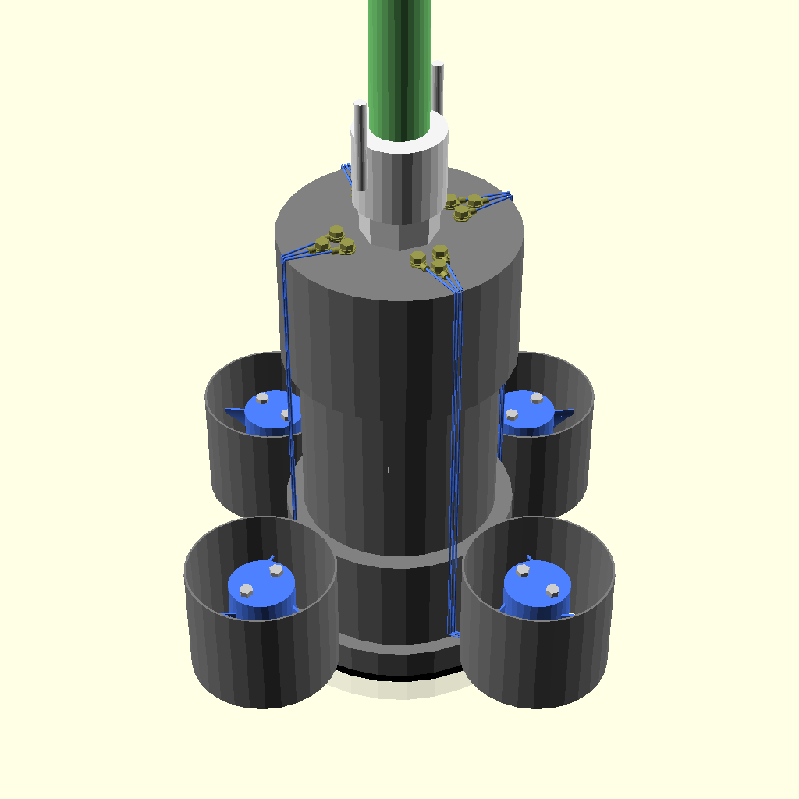
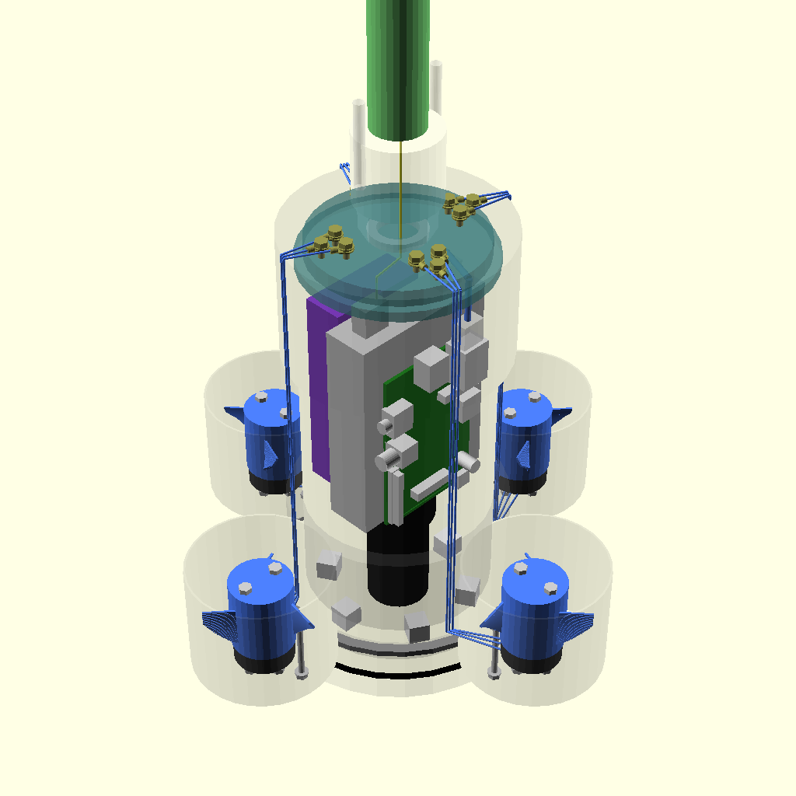

# ROV

Underwater ROV Prototype.

Target specifications:
- Live 1080p video.
- 0-100m depth.
- Cost efficient and reproducable.

## Development

Editable in [OpenSCAD](https://www.openscad.org/downloads.html).

[Preview](./rov.stl)

[BOM](./BOM.txt)

